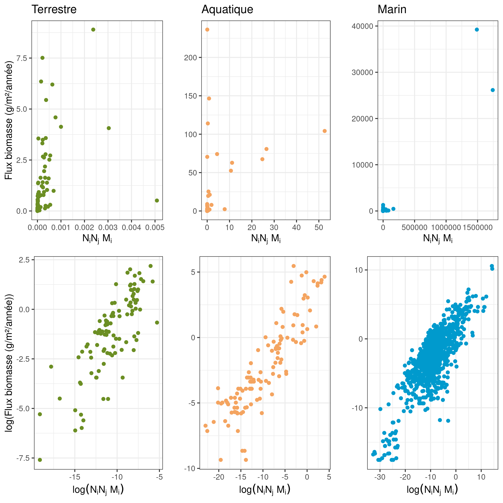
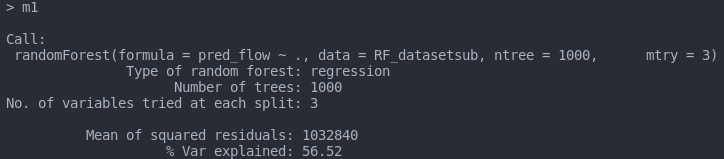
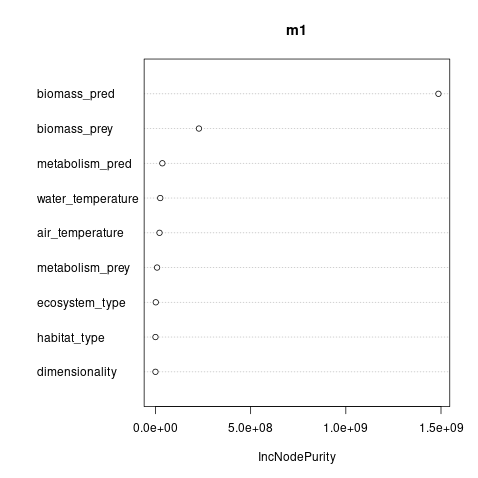

```{r setup, echo = F}
knitr::opts_chunk$set(
  comment = "#",
  #cache = TRUE,
  collapse = TRUE,
  warning = FALSE,
  message = FALSE,
  fig.width = 7,
  fig.height = 5.25,
  fig.align = 'center',
  fig.retina = 3
)

# base plot layout
mypar = list(mar = c(3,3,0.5,0.5), mgp = c(1.5, 0.3, 0), tck = -.008)

# xaringan Extra
xaringanExtra::use_xaringan_extra(c("tile_view", "animate_css", "tachyons"))
xaringanExtra::use_extra_styles(
  hover_code_line = TRUE,         #<<
  mute_unhighlighted_code = TRUE  #<<
)
xaringanExtra::use_editable(expires = 1)
xaringanExtra::use_panelset()
```

class:  middle, title-slide, 

<div class="my-logo-left"></div>
<br><br><br>
# Mécanismes de flux d'énergie en interactions trophiques 
<br>
<hr width="45%" align="left" size="0.3" color="orange"></hr>
<br>
## Deuxième rencontre  <br> de comité
<br>
## .font70[Benjamin Mercier, <br>.small[Étudiant à la maîtrise]]<br><br>
<i class="fa fa-github fa-2x" style="color:#FAFAFA"></i> [BenMerSci/master](https://github.com/BenMerSci/master)

---
# Aperçu annuel
- Maîtrise (construction du jeu de données et début analyse)
- Participé/collaboré sur deux articles
- Groupe de travail G3E benthos
- Auxiliaire d'enseignement BIO109
- Formations BIOS2: visualisation de données, site HUGO, package R, Shiny application
- École d'été en modélisation de la biodiversité (Bayesien)
- Stage KBA de 2 mois avec BIOS2 (Shiny application)
- Assistant software carpentry
- Quelques séances de bénévolat au centre d'entraide par les pairs en biologie

---
class: inverse
<br><br><br><br><br><br>
.center[.font180[**Projet**]]
<hr width="70%" align="center" size="2.0" color="orange"></hr>

---
# Justification et préambule
- Interactions quantitatives difficilement échantillonables
- Beaucoup de Lotka-Volterra, moins de mécanistique
- Beaucoup de développement de relations allométriques en interactions interspécifiques

<br>
<hr width="100%" align="center" size="2.0" color="orange"></hr>
<br>


- Pawar 2012: relations allométriques vitesse et dimensionalité<br>
- Brose 2010, Schneider 2016: foraging contraint allométriquement (recherche et métabolisme)<br>
- Hirt 2017-2019: relations allométriques vitesse<br>
- CLoyed 2021: complexité de l'habitat


---
# Objectifs
<br>
<p class="box"><br>
.center[Développer un modèle mécanistique de prédiction des flux de biomasse entre une proie et son prédateur, généralisable à plusieurs types d'interaction trophique]
<br></p>
<hr width="100%" align="center" size="2.0" color="orange"></hr>
<br>

.center[- Comparaison avec un modèle phénoménologique (RandomForest)]
<br>
.center[- Comparaison inter-écosystème et définir si possible les paramètres clés respectivement]

---
# Hypothèses

**1. Modèle nul:** Flux définis par une constante
<br><br>

**2. Mass action constant:** Flux définis par l'abondance des proies et prédateurs, normalisé par une constante fixe
<br><br>

**3. Mass action prédateur:** Flux définis par l'abondance des proies et prédateurs, normalisé par une constante prédateur-spécifique
<br><br>

**4. Mass action prédateur-proie:** Flux définis par l'abondance des proies et prédateurs, normalisé par une constante d'interaction
<br><br>

**5. Saturation neutre:** Saturation des flux avec l'augmentation de l'abondance des proies
<br><br>

**6. Saturation trait-matching:** Saturation des flux per capita selon un trait-matching predateur-proie

---
# Modèles et équations

**1. Modèle nul:** 
.pull-left[
  $$F_{ij}^{real} = K_j$$
]

.pull-right[
  où $K_j$ est une constante
]

<hr width="95%" align="center" size="2.0" color="orange"></hr>
<br>

**2. Mass action constant:**

.pull-left[
   $F_{ij}^{real} = \alpha*N_i*N_j*M_i$
]

.pull-right[
  où<br>
  $\alpha$ est une constante<br>
  $N_i$ est l'abondance de la proie<br>
  $N_j$ est l'abondance du prédateur<br>
  $M_i$ est la masse de la proie
]

---
# Modèles et équations

**3. Mass action prédateur:** 

.pull-left[
  $F_{ij}^{real} = \alpha_j*N_i*N_j*M_i$
]

.pull-right[
  où<br>
  $\alpha_j$ est une constante spécifique au prédateur
]

<hr width="100%" align="center" size="2.0" color="orange"></hr>

**4. Mass action prédateur-proie:**

.pull-left[
  $F_{ij}^{real} = \alpha_{ij}*N_i*N_j*M_i$<br>
  $\alpha_{ij} = \frac{\phi_j}{D_j}$
]

.pull-right[
  où<br>
  $\phi_j$ est une constante prédateur-spécifique<br>
  $D_j$ est le degré du prédateur
]
---
# Modèles et équations

**5. Saturation neutre:**

.pull-left[
  $F_{ij}^{real} = \frac{F_{ij}^{max}}{1+h_j*\sum{F_{ij}^{max}}}$
]

.pull-right[
  où<br>
  $F_{ij}^{max} = \alpha_{ij}*N_i*N_j*M_i$ et $\alpha_{ij} = \frac{\phi_j}{D_j}$
]

<hr width="100%" align="center" size="2.0" color="orange"></hr>

**6. Saturation trait-matching:**

.pull-left[
  $F_{ij}^{real} = \frac{F_{ij}^{max}}{1+h_j*\sum{F_{ij}^{max}}}$
]

.pull-right[
  où<br>
  $F_{ij}^{max} = \alpha_{ij}*N_i*N_j*M_i$<br>
  $\alpha_{ij} = f(M_i,M_j,D)$
]

.center[
  $\alpha_{ij} =$ probabilité d'attaque x succès d'attaque x probabilité de rencontre 
]

<br>
<hr width="100%" align="center" size="2.0" color="orange"></hr>

---
# Plan d'analyse
- Fitter les modèles par Simulated annealing généralisé
- Effectuer les prédictions/validations
- Calculer des AIC et R²
- Classer les modèles selon les valeurs d'AIC/R²

---
# Les données
.center[116 réseaux Ecopath [(Jacquet et al. 2016)](https://www.nature.com/articles/ncomms12573)]

<hr width="95%" align="center" size="2.0" color="orange"></hr>
<br>
.center[**Résumé méthode Ecopath:**]
- Flux de biomasse (g/m²/année) entre espèces ou groupes fonctionnels
- Système mass-balanced: .font60[$$\frac{dB_i}{dt}=0$$]
- **Paramètres initiaux:** Biomasse, ratio production/biomasse, ratio consommation/biomasse, efficacité écotrophique et composition de la diète

<br><br>
.center[**Attention circularité?**]

<!--.center[Production = Capture + Accumulation biomasse + <br>
&nbsp;&nbsp;&nbsp;&nbsp;&nbsp;&nbsp;&nbsp;&nbsp;&nbsp;&nbsp;predation mortalité + migration nette + autre mortalité]--->

---
# Traitements de données
1. Correspondance des espèces entre réseaux et articles
2. Formattage des matrices d'interactions
3. Résoudre la taxonomie
4. Correspondance des réseaux avec Ecobase 
5. Récupérer les traits d'espèces
6. Récupérer les traits de l'environnement
7. Créer la table finale d'interactions

---
# Les données utilisées 
.center[]

---
# Les interactions
.center[Organismes: <br><br> .center[]]
<br>
<hr width="95%" align="center" size="2.0" color="orange"></hr>
<br>
.center[935 interactions entre espèces &rarr; 566 interactions uniques]
<br>
<br>
```{r, include=FALSE}
library(knitr)
library(kableExtra)
library(dplyr)
dataset <- readRDS("../master/data/clean/dataset.RDS")
habitat_df <- data.frame(terrestrial = nrow(dataset[which(dataset$habitat_type == "terrestrial"),]), 
                         freshwater = nrow(dataset[which(dataset$habitat_type == "freshwater"),]),
                         marine = nrow(dataset[which(dataset$habitat_type == "marine"),]))
habitat_df_unique <- data.frame(terrestrial = nrow(unique(dataset[which(dataset$habitat_type == "terrestrial"),c("prey","predator")])), 
                         freshwater = nrow(unique(dataset[which(dataset$habitat_type == "freshwater"),c("prey","predator")])),
                         marine = nrow(unique(dataset[which(dataset$habitat_type == "marine"),c("prey","predator")])))
#rownames(habitat_df) <- "Number of unique interactions"
```

.pull-left[
```{r, echo=FALSE}
kable(habitat_df, align = "ccc", caption = "Nombre d'interaction par type habitat")
```
]
.pull-right[
```{r, echo=FALSE}
kable(habitat_df_unique, align="ccc", caption="Nombre d'interaction unique par type d'habitat")
```
]

---
# Les traits
.panelset[

.panel[.panel-name[Organismes]
- Biomasse (g/m²)
- Masse corporelle (g)
- Estimé d'abondance selon biomasse et masse corporelle
- Degré des prédateurs (nombre de proies)
- Classe métabolique
- Vitesse (?)
]

.panel[.panel-name[Environnement]
- Température de l'air
- Température de l'eau (surface)
- Type d'ecosystème
- Type d'habitat
- Dimmensionalité de l'interaction
]
]

---
# Figures préliminaires
.center[]

---
# Analyses préliminaires
.center[]

.center[]

---
# Remerciements

.pull-left1[

.center[**Mon comité:**<br>
  Dominique Gravel<br>
  Guillaume Blanchet<br>
  Pierre Legagneux<br>
  Laura Pollock<br><br>
**Les membres du laboratoire <br>d'écologie intégrative**<br>
<br>
<p class="box"><br>.center[**Nous remercions le Conseil de Recherches en Sciences Naturelles et Génie du Canada (CRSNG) et le Fonds de recherche Nature et technologies pour leur soutien. En parallèle, le programme BIOS2 est supporté par le CRSNG.**]<br></p>
]]
.pull-rightfin[
  <br>
  ]

---
# Icons
- <div>Icons made by <a href="https://www.freepik.com" title="Freepik">Freepik</a> from <a href="https://www.flaticon.com/" title="Flaticon">www.flaticon.com</a></div>
