```{r setup, echo = F}
knitr::opts_chunk$set(
  comment = "#",
  #cache = TRUE,
  collapse = TRUE,
  warning = FALSE,
  message = FALSE,
  fig.width = 7,
  fig.height = 5.25,
  fig.align = 'center',
  fig.retina = 3
)

# base plot layout
mypar = list(mar = c(3,3,0.5,0.5), mgp = c(1.5, 0.3, 0), tck = -.008)

# xaringan Extra
xaringanExtra::use_xaringan_extra(c("tile_view", "animate_css", "tachyons"))
xaringanExtra::use_extra_styles(
  hover_code_line = TRUE,         #<<
  mute_unhighlighted_code = TRUE  #<<
)
xaringanExtra::use_editable(expires = 1)
xaringanExtra::use_panelset()
```

class:  middle, title-slide,

<div class="my-logo-left"></div>
<br><br><br>
# Modèles mécanistiques d'interactions<br> prédateur-proie
<br>
<hr width="45%" align="left" size="0.3" color="orange"></hr>
<br>
## Séminaire de  <br> recherche II <br> PBI702
<br>
## .font70[Benjamin Mercier, <br>.small[Étudiant à la maîtrise]]<br><br>
<i class="fa fa-github fa-2x" style="color:#FAFAFA"></i> [BenMerSci/master](https://github.com/BenMerSci/master)

---

# Introduction
<br>
.center[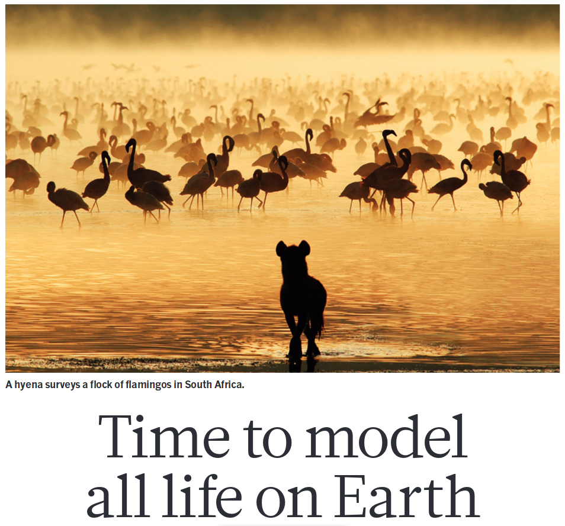]
<br><br>

.cite[Purves et al. 2013]

---

# Modèle général d'écosystème
<br>
.center[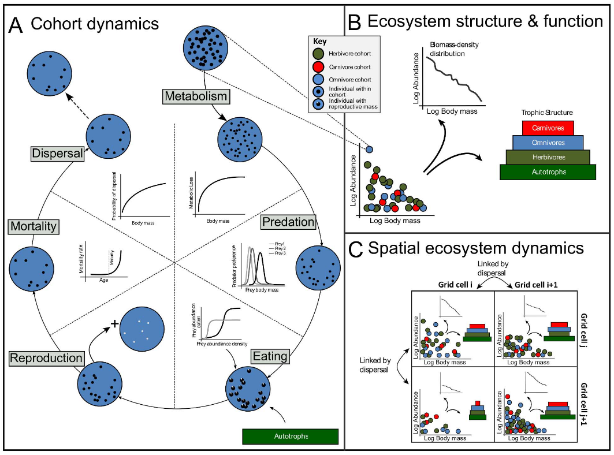]

.cite[Harfoot et al. 2014]

---

# Dynamique de prédation/consommation
<br>
<p class="box"><br>
.center[Logistiquement impossible d'échantilloner empiriquement]
<br></p>
<br>

.center[
  Trop d'interactions<br>
  Biais dans les interactions
]
<br>
<hr width="80%" align="center" size="2.0" color="orange"></hr>
<br>

.center[&darr;]

.center[Modélisation]

.cite[Jordano et al. 2016]

---

# Justification

<p class="box"><br>
.center[Plusieurs différents modèles existent déjà]
<br></p>
.center[.center[&darr;]]

.pull-left[.center[<u>Lotka-Volterra</u>]<br>
  .center[Semblant d'action de masse]
  .center[]
]

.pull-right[.center[<u>Rozenzweig-MacArthur</u>]
<br>
  .center[Modèle de saturation sur la consommation (temps alloué à la prédation et densité de proies)]
]

---

# Justification (suite)

<p class="box"><br>
.center[Modèles plus complexes]
<br></p>
.center[.center[&darr;]]

.pull-left[.center[<u>Modèle réseau-trophique-allométrique</u>]<br>
  .center[Données d'entrées plus complexes (taux)]
]

.pull-right[.center[<u>Modèles mécanistiques</u>]<br>
  .center[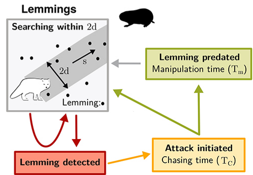]
]

.cite[Brose et al. 2006, Berlow et al. 2009, Beardsell et al. 2021]

---

class: inverse

# .center[Objectif]

<br><br><br>

.center[
Développer un modèle mécanistique de prédiction de la prédation entre une proie et son prédateur, généralisable à plusieurs types d'interactions trophiques
]

---

class: inverse

# .center[Hypothèses]

<br><br><br>
.center[
  **0. Modèle nul** <br><br>
  Le prédation entre une proie $i$ et un prédateur $j$ est déterminée par une constante (intercept nul)
<br>
<hr width="80%" align="center" size="2.0" color="orange"></hr>
<br>
  **1. Modèle d'action de masse général**<br><br>
  La prédation entre une proie $i$ et un prédateur $j$ est déterminée par la biomasse des proies, l'abondance des prédateurs et un taux de recherche général des prédateurs
]

---

class: inverse

# .center[Hypothèses]

<br><br><br>
.center[
  **2. Modèle d'action de masse spécifique**<br><br>
  La prédation entre une proie $i$ et un prédateur $j$ est déterminée par la biomasse des proies, l'abondance des prédateurs et un taux de recherche spécifique à l'identité des prédateurs
<br>
<hr width="80%" align="center" size="2.0" color="orange"></hr>
<br>
  **3. Modèle de saturation**<br><br>
  La prédation entre une proie $i$ et un prédateur $j$ est déterminée par la biomasse des proies, l'abondance des prédateurs et un taux de recherche spécifique, mais avec un effet de saturation lié au temps de traitement des proies
]

---

# Modèles et équations

**0. Modèle nul:** 
.pull-left[
  $$F_{ij} = K$$
]

.pull-right[
  $K$: intercept constant
]

<br>
<hr width="100%" align="center" size="2.0" color="orange"></hr>
<br>

**1. Action de masse général:**

.pull-left[
   $$F_{ij} = \alpha \times B_i \times N_j$$<br>
]

.pull-right[
  $\alpha$: $\frac{km²}{individu \times année}$<br><br>
  $B_i$: $\frac{tonnes}{km²}$<br><br>
  $N_j$: $\frac{individu}{km²}$<br>
]

---

# Modèles et équations (suite)
**2. Action de masse prédateur spécifique:** 

.pull-left[
  $$F_{ij} = \alpha_j \times B_i \times N_j$$
]

.pull-right[
  $\alpha_j$: $\frac{km²}{individu \times année}$
]

<br>
<hr width="100%" align="center" size="2.0" color="orange"></hr>
<br>

**3. Saturation avec temps de traitement:**

.pull-left[
  $$F_{ij} = \frac{\alpha_j \times B_i \times N_j}{1 + h_j \times \alpha_j \times sumB \times N_j}$$
]

.pull-right[
  $h_j$: $\frac{année \times km²}{tonnes}$<br><br>
  $sumB$: $\frac{tonnes}{km²}$

]

---

# Les données
.center[19 réseaux d'interactions]

.center[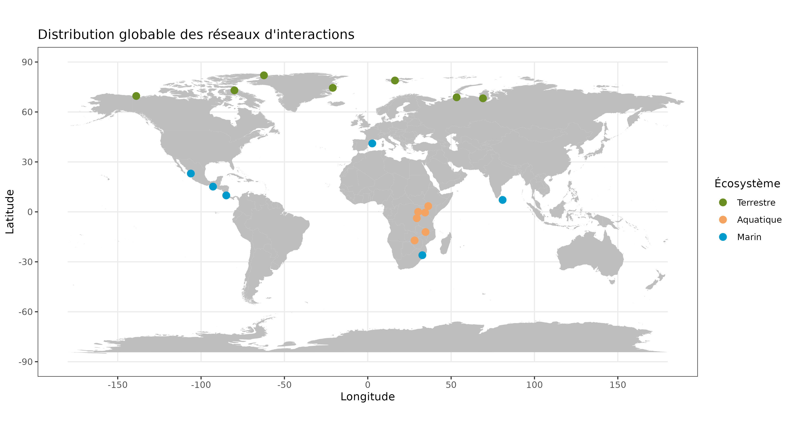]

---

# Les données (suite)

- Jeu de données de 1380 interactions quantitatives
- Flux de biomasse $F_{ij}$ (tonnes/km²*année)
- Biomasse proies $B_i$ (tonnes/km²)
- Biomasse prédateurs $B_j$ (tonnes/km²)

<br>
<hr width="100%" align="center" size="2.0" color="orange"></hr>
<br>

.center[Autre base de donneés: <br>

Masses corporelles prédateurs $M_j$]

<br>
<p class="box"><br>
.center[Abondance $N_j = \frac{B_j}{M_j}$]
<br></p>

---

# Méthode

1. Correspondance des espèces
2. Résolution de la taxonomie
3. Récupérer les traits d'espèces
4. Formatter les réseaux d'interactions
5. Modélisation

---

# Analyses

.center[Modélisation avec Stan ]
<br>
<hr width="100%" align="center" size="2.0" color="orange"></hr>
<br>

- Langage de modélisation statistique Bayesian
- Estimation des paramètres $\alpha$ et $h_j$
- Prédiction sur les données
- R² et comparaison de modèles

---

# Classement des modèles

<br>

<p class="box"><br>
 .center[Classement réalisé avec une méthode similaire à l'AIC]
<br></p>

<br>
.center[**Rangs:**

|Modèle   |   elpd_diff|  se_diff|
|:--------|-----------:|--------:|
|modèle 4 |        0.00|     0.00|
|modèle 3 |      -33.51|     9.69|
|modèle 1 |     -731.68|    43.27|
|modèle 2 |    -1416.58|    40.75|
]

---

# Modèles 0 et 1

<br><br><br>

.center[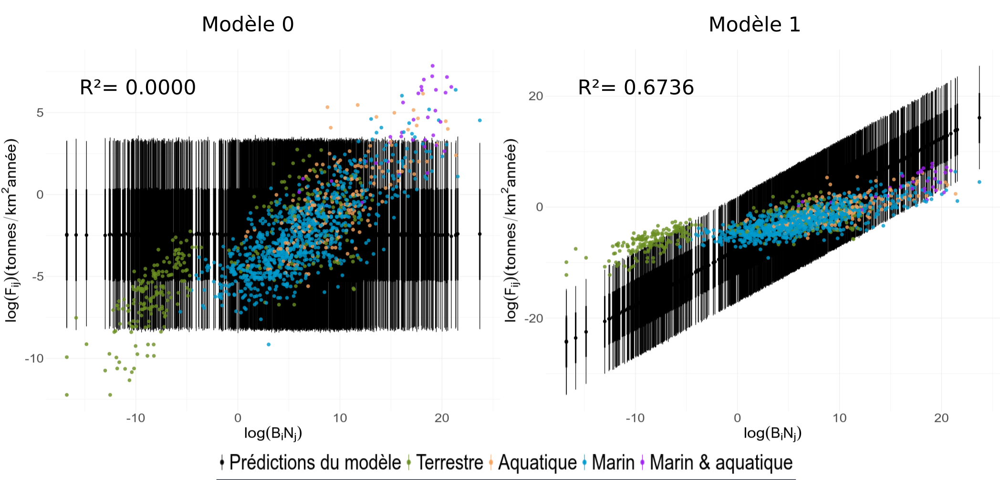]

---

# Modèles 1 et 2

<br><br><br>

.center[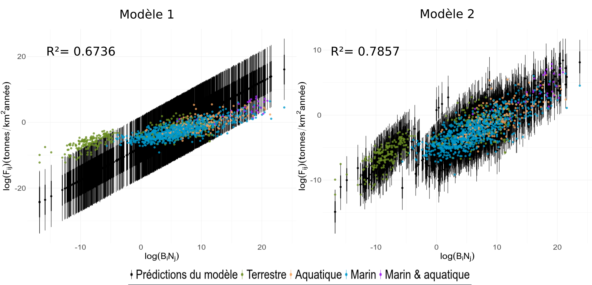]

---

# Modèles 2 et 3

<br><br><br>

.center[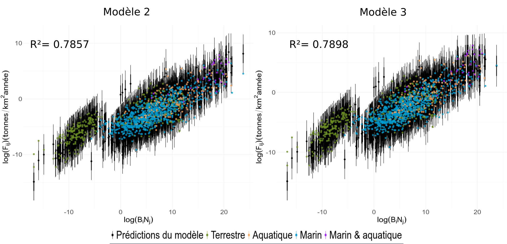]


---

# Paramètre $\alpha$ - modèle 2
.center[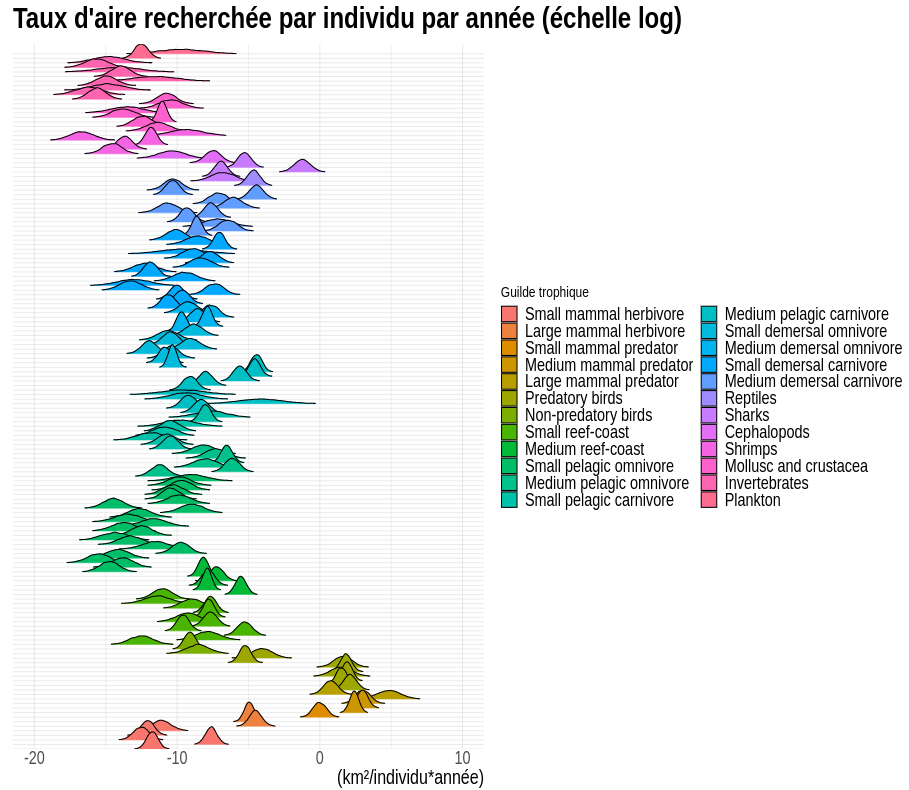]

---

# Paramètre $\alpha$ - modèle 3
.center[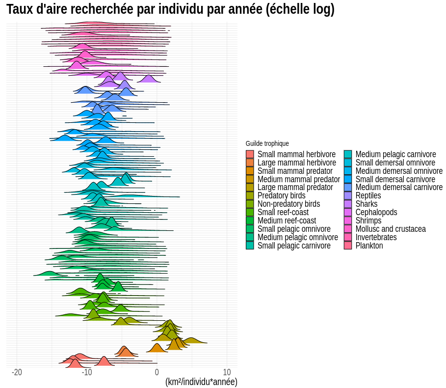]


---

# Paramètre $h_j$ - modèle 3
.center[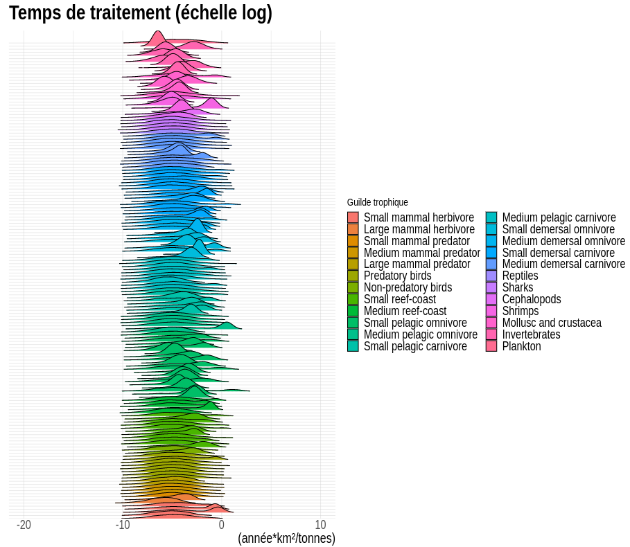]

---

# Classement des modèles

<br><br><br><br>
<p class="box"><br>
 .center[Modèle 3 > modèle 2 > modèle 0 > modèle 1]
<br></p>

<br>
<hr width="100%" align="center" size="2.0" color="orange"></hr>
<br>

.center[&darr;]

.center[**Modèle 2 plus réaliste écologiquement**]

---

# Relations allométriques

.center[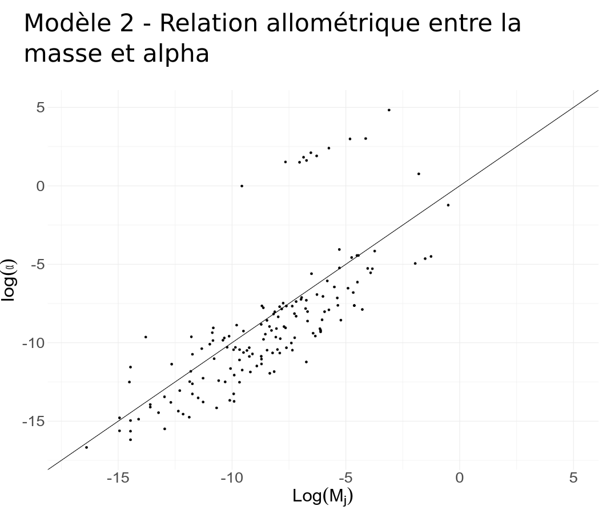]

---

# Relations allométriques

.center[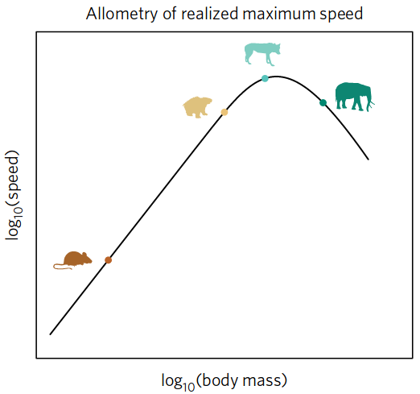]

.cite[Hirt et al. 2017]

---

# Conclusion
- Récolter davantage d'interactions pour préciser les paramètres alpha
- Formaliser la relation allométrique
- Valider les modèles sur d'autres interactions trophiques

---

# Remerciements

.pull-left1[

.center[**Mon comité:**<br>
  Dominique Gravel<br>
  Guillaume Blanchet<br>
  Pierre Legagneux<br>
  Laura Pollock<br><br>
**Les membres du laboratoire <br>d'écologie intégrative**<br>
<br>
<p class="box"><br>.center[**Nous remercions le Conseil de Recherches en Sciences Naturelles et Génie du Canada (CRSNG) et le Fonds de recherche Nature et technologies pour leur soutien. En parallèle, le programme BIOS2 est supporté par le CRSNG.**]<br></p>
]]
.pull-rightfin[
  <br>
  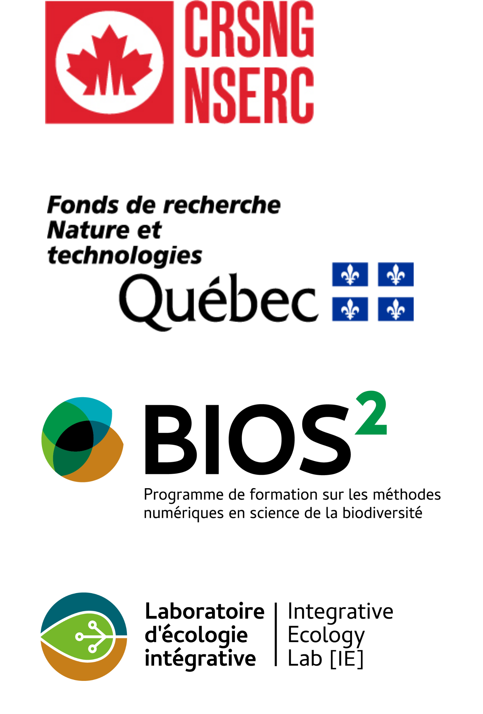]


---

# Supp. mat.

.center[**Interactions**]
.center[Terrestre: **298**  Aquatique: **187**  Marine: **895**]
